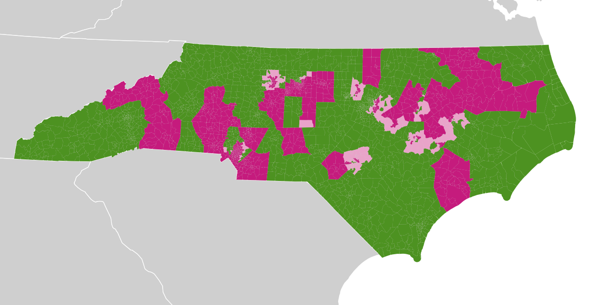
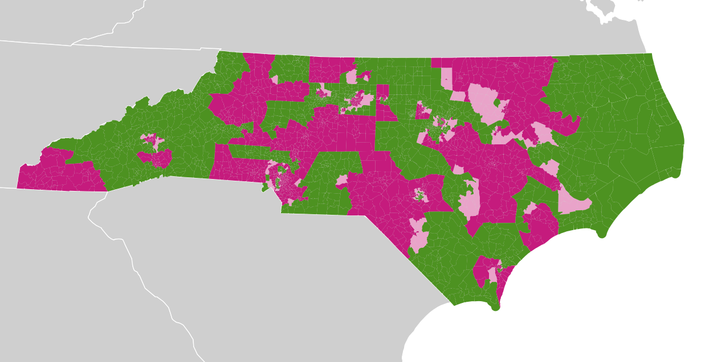

North Carolina 2014
---

*Michal Migurski, June 2017*

This model of votes in North Carolina is based on the 2014 General Election,
using [vote counts from OpenElections](https://github.com/openelections/openelections-results-nc/blob/8d4eb39ed73ecad1460f08f7cddc518f05b968ff/raw/20141104__nc__general__precinct__raw.csv)
and precinct geography from [Nathaniel Vaughn Kelso’s Election-Geodata](https://github.com/nvkelso/election-geodata/tree/47d1ab793d96546fece39f0e112d8ae504c2ceb8/data/37-north-carolina/statewide/2014).
A Jupyter Notebook with Python code detailing the process
[can be found in my Redistricting repository](https://github.com/migurski/Redistricting/blob/3b5cbbef8d4e949f30a22892f9ffbea0e889e7ec/37%20-%20North%20Carolina/NC%20Imputation%20for%20PlanScore.ipynb)
as well as in the linked files below.

Congressional votes are complete for 12 of 13 districts;
[District 9 was uncontested](https://ballotpedia.org/United_States_House_of_Representatives_elections_in_North_Carolina,_2014)
and its votes were derived from other precincts. Numerous State Senate and State
House races were uncontested, and their votes were derived from other precincts
as well.

Imputed votes were calculated using linear regression based on factors like
other races, racial demographics, age, education, and income after analyzing
known data to determine which factors best predicted outcomes.

Precincts with contested (green) and uncontested (purple) State Senate and State House races:

