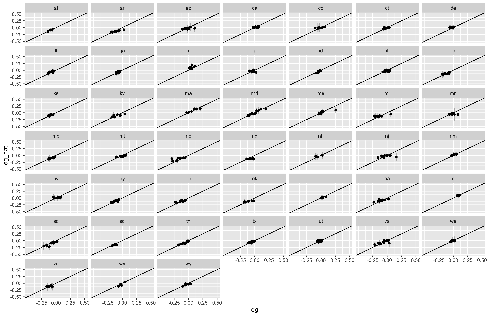

Unified District Model
===

_December 2020_

In order to score new plans, it is necessary to create a statistical model of the relationship between districts’ latent partisanship and candidates’ incumbency status with election outcomes. This enables us to estimate district-level vote shares for a new map and the corresponding partisan gerrymandering metrics. This page describes the details of our methodology and how we validate the results of this model.

In some cases, uncontested elections are imputed as described in [*The Impact of Partisan Gerrymandering on Political Parties*](https://onlinelibrary.wiley.com/doi/abs/10.1111/lsq.12276) and [its appendix](https://onlinelibrary.wiley.com/action/downloadSupplement?doi=10.1111%2Flsq.12276&file=lsq12276-sup-0001-Supinfo.pdf), by Nicholas Stephanopoulos and Christopher Warshaw.

Predictions
---

The charts below show comparisons between this model’s predictions with observed historical numbers for plans with at least 7 districts.

Methodology
---

The vote share inputs for calculating the metrics come from a Bayesian hierarchical model of district-level election returns, run for all state legislatures and congressional delegations on the elections from 2012 through 2018. Formally, the model is:

where

- <var style="font-family:serif">i</var> indexes district level elections
- <var style="font-family:serif">s</var> indexes states, with <var style="font-family:serif">s(i)</var> denoting the state of district election <var style="font-family:serif">i</var>
- <var style="font-family:serif">c</var> indexes election cycles, with <var style="font-family:serif">c(i)</var> denoting the election cycle of district election <var style="font-family:serif">i</var>
- <var style="font-family:serif">yi</var> is the Democratic share of the two-party vote in district election <var style="font-family:serif">i</var>
- <var style="font-family:serif"><b>X</b>i</var> is a matrix of covariate values for district election <var style="font-family:serif">i</var>
- <var style="font-family:serif">β</var> is a matrix of population-level intercept and slopes corresponding to covariates <var style="font-family:serif"><b>X</b></var>
- <var style="font-family:serif">βs(i)</var> and <var style="font-family:serif">βc(i)</var> are matrices of coefficients for the state and election cycle, respectively, of district election <var style="font-family:serif">i</var>
- <var style="font-family:serif">σy</var> is the residual population-level error term

The model includes two covariates: 1) the two-party district-level Democratic presidential vote share, averaged across 2012 and 2016 and centered around its global mean; 2) the incumbency status in district election *i*, coded -1 for Republican, 0 for open, and 1 for Democratic. The model allows the slope for each–as well as the corresponding intercept– to vary across both states and election cycles. Chambers accounted for minimal variation in an ANOVA test, so state legislative and congressional results were modeled together as emerging from a common distribution.

When generating predictions, PlanScore assumes an average election year for the 2012- 2018 period (*βc* = 0), but otherwise draws from the posterior distribution of model param- eters for means and probabilities.

<table>
    <caption>Table 1: PlanScore prediction model results</caption>
    <thead>
        <tr>
            <th></th>
            <th style="text-align:right">Estimate</th>
            <th style="text-align:center">95% Credible Interval</th>
        </tr>
    </thead>
    <tbody>
        <tr>
            <th colspan="3" style="padding-top:.5em">POPULATION-LEVEL</th>
        </tr>
        <tr>
            <td style="font-weight:normal">Intercept (<var style="font-family:serif">β0</var>)</td>
            <td align="right">0.50</td>
            <td align="center">[0.45, 0.55]</td>
        </tr>
        <tr>
            <td style="font-weight:normal">Presidential vote (<var style="font-family:serif">β1</var>)</td>
            <td align="right">0.79</td>
            <td align="center">[0.58, 1.00]</td>
        </tr>
        <tr>
            <td style="font-weight:normal">Incumbency (<var style="font-family:serif">β2</var>)</td>
            <td align="right">0.05</td>
            <td align="center">[0.02, 0.08]</td>
        </tr>
        <tr>
            <th colspan="3" style="padding-top:.5em">STATE-LEVEL</th>
        </tr>
        <tr>
            <th colspan="3" style="padding-top:.5em">Standard Deviations</th>
        </tr>
        <tr>
            <td style="font-weight:normal">Intercept (<var style="font-family:serif">σβ0s</var>)</td>
            <td align="right">0.02</td>
            <td align="center">[0.02, 0.03]</td>
        </tr>
        <tr>
            <td style="font-weight:normal">Presidential vote (<var style="font-family:serif">σβ1s</var>)</td>
            <td align="right">0.13</td>
            <td align="center">[0.10, 0.16]</td>
        </tr>
        <tr>
            <td style="font-weight:normal">Incumbency (<var style="font-family:serif">σβ2s</var>)</td>
            <td align="right">0.02</td>
            <td align="center">[0.02, 0.03]</td>
        </tr>
        <tr>
            <th colspan="3" style="padding-top:.5em">Correlations</th>
        </tr>
        <tr>
            <td style="font-weight:normal">Intercept - Pres. vote (<var style="font-family:serif">ρσβ0s</var><var style="font-family:serif">σβ1s</var>)</td>
            <td align="right">−0.41</td>
            <td align="center">[−0.62,−0.15]</td>
        </tr>
        <tr>
            <td style="font-weight:normal">Intercept - Incumbency (<var style="font-family:serif">ρσβ0s</var><var style="font-family:serif">σβ2s</var>)</td>
            <td align="right">0.11</td>
            <td align="center">[−0.17, 0.39]</td>
        </tr>
        <tr>
            <td style="font-weight:normal">Pres. vote - Incumbency (<var style="font-family:serif">ρσβ1s</var><var style="font-family:serif">σβ2s</var>)</td>
            <td align="right">−0.73</td>
            <td align="center">[−0.85,−0.56]</td>
        </tr>
        <tr>
            <th colspan="3" style="padding-top:.5em">CYCLE-LEVEL</th>
        </tr>
        <tr>
            <th colspan="3" style="padding-top:.5em">Standard Deviations</th>
        </tr>
        <tr>
            <td style="font-weight:normal">Intercept (<var style="font-family:serif">σβ0c</var>)</td>
            <td align="right">0.04</td>
            <td align="center">[0.01, 0.14]</td>
        </tr>
        <tr>
            <td style="font-weight:normal">Presidential vote (<var style="font-family:serif">σβ1c</var>)</td>
            <td align="right">0.18</td>
            <td align="center">[0.07, 0.48]</td>
        </tr>
        <tr>
            <td style="font-weight:normal">Incumbency (<var style="font-family:serif">σβ2c</var>)</td>
            <td align="right">0.02</td>
            <td align="center">[0.01, 0.07]</td>
        </tr>
        <tr>
            <th colspan="3" style="padding-top:.5em">Correlations</th>
        </tr>
        <tr>
            <td style="font-weight:normal">Intercept - Pres. vote (<var style="font-family:serif">ρσβ0c</var><var style="font-family:serif">σβ1c</var>)</td>
            <td align="right">−0.13</td>
            <td align="center">[−0.84, 0.70]</td>
        </tr>
        <tr>
            <td style="font-weight:normal">Intercept - Incumbency (<var style="font-family:serif">ρσβ0c</var><var style="font-family:serif">σβ2s</var>)</td>
            <td align="right">−0.23</td>
            <td align="center">[−0.89, 0.68]</td>
        </tr>
        <tr>
            <td style="font-weight:normal">Pres. vote - Incumbency (<var style="font-family:serif">ρσβ1c</var><var style="font-family:serif">σβ2c</var>)</td>
            <td align="right">−0.46</td>
            <td align="center">[−0.95, 0.54]</td>
        </tr>
        <tr>
            <td colspan="3" style="padding-top:1em;font-weight:normal">
                Note: Model estimated in brms for R. Model based on 4 MCMC chains run for 4000 iterations each with a 2000 iteration warm-up. All model parameters converged well with <var>R</var> < 1.01.
            </td>
        </tr>
    </tbody>
</table>
