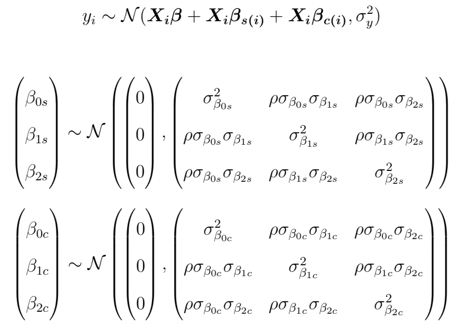
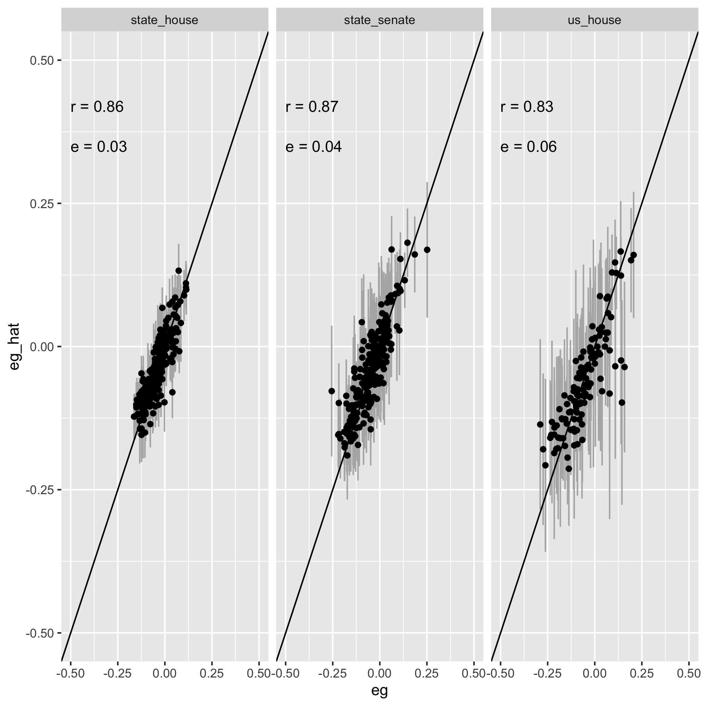
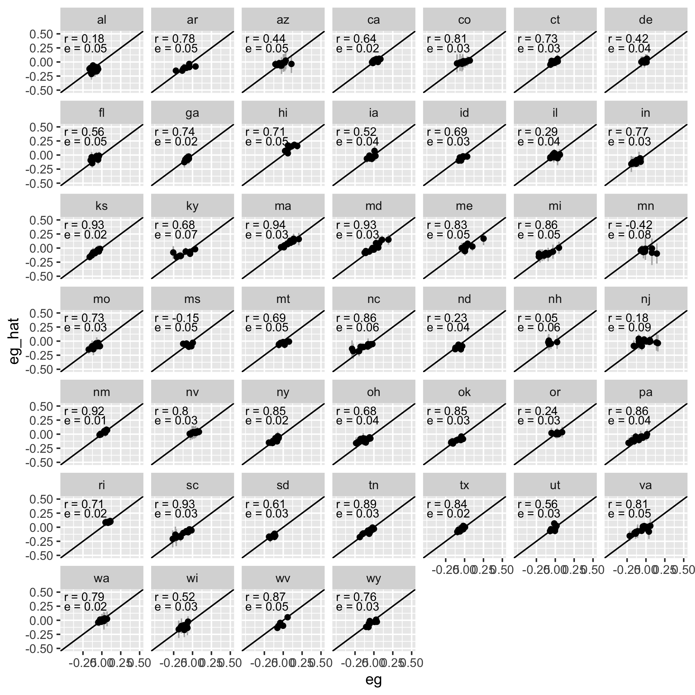
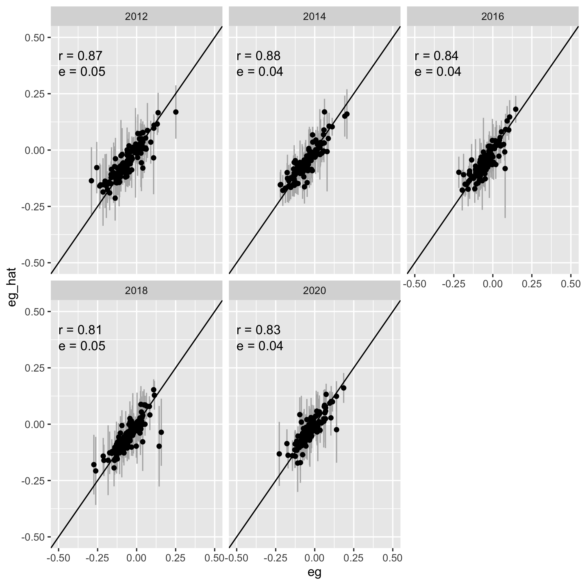

Unified District Model
===

_November 2021_

In order to score new plans, it is necessary to create a statistical model of the relationship between districts’ latent partisanship and candidates’ incumbency status with election outcomes. This enables us to estimate district-level vote shares for a new map and the corresponding partisan gerrymandering metrics. This page describes the details of our methodology and how we validate the results of this model.

Results for uncontested elections are imputed as described in [*The Impact of Partisan Gerrymandering on Political Parties*](https://onlinelibrary.wiley.com/doi/abs/10.1111/lsq.12276) and [its appendix](https://onlinelibrary.wiley.com/action/downloadSupplement?doi=10.1111%2Flsq.12276&file=lsq12276-sup-0001-Supinfo.pdf), by Nicholas Stephanopoulos and Christopher Warshaw.

Methodology
---

#### The Big Picture

We use the correlation between the presidential vote on the one hand, and state legislative and congressional votes on the other, to predict how new districts will likely vote and so how biased a plan will be. Our correlations come from the last 10 years of elections, and factor in both any extra advantage incumbents might have as well as how much each state’s results might differ from others. We also allow our predictions to be imperfect by quantifying how much our method missed the actual outcomes of past elections, including the degree to which partisan tides have changed party performance from one election to the next. This enables us to generate the most accurate, data-driven, and transparent prediction we can.

#### The Details

We use a Bayesian hierarchical model of district-level election returns, run for all state legislatures and congressional delegations on the elections from 2012 through 2020. Formally, the model is:

where

- <var style="font-family:serif">i</var> indexes district level elections
- <var style="font-family:serif">s</var> indexes states, with <var style="font-family:serif">s(i)</var> denoting the state of district election <var style="font-family:serif">i</var>
- <var style="font-family:serif">c</var> indexes election cycles, with <var style="font-family:serif">c(i)</var> denoting the election cycle of district election <var style="font-family:serif">i</var>
- <var style="font-family:serif">yi</var> is the Democratic share of the two-party vote in district election <var style="font-family:serif">i</var>
- <var style="font-family:serif"><b>X</b>i</var> is a matrix of covariate values for district election <var style="font-family:serif">i</var>
- <var style="font-family:serif">β</var> is a matrix of population-level intercept and slopes corresponding to covariates <var style="font-family:serif"><b>X</b></var>
- <var style="font-family:serif">βs(i)</var> and <var style="font-family:serif">βc(i)</var> are matrices of coefficients for the state and election cycle, respectively, of district election <var style="font-family:serif">i</var>
- <var style="font-family:serif">σy</var> is the residual population-level error term

The model allows the slope for all our covariates—as well as the corresponding intercept—to vary across both states and election cycles. Chambers accounted for minimal variation in an ANOVA test, so state legislative and congressional results were modeled together as emerging from a common distribution. The model includes two covariates: 1) the two-party district-level Democratic presidential vote share, centered around its global mean (0.494); and 2) the incumbency status in district election i, coded -1 for Republican, 0 for open, and 1 for Democratic. We do not have the 2020 presidential vote for estimating new plans in four states—Kentucky, New Jersey, New Mexico, and South Dakota—so we used the 2016 presidential vote in the model for those states. In the small number of state-cycle combinations that were missing presidential vote we used the presidential vote for the same district in the next presidential election (or the previous presidential election where the next one was not available).

When generating predictions, PlanScore draws 1000 samples from the posterior distribu- tion of model parameters, and uses them to calculate means and probabilities. We also add in the offsets for the 2020 presidential election cycle, and then also add in samples from the covariance matrix of cycle random effects to allowing the uncertainty of predicting for an unknown election cycle to propagate into our predictions. This has the effect of predicting for an election like 2020 in most respects, but with error bounds that encompass the full range of partisan tides that occurred over the last decade.

<table>
    <caption>Table 1: PlanScore prediction model results</caption>
    <thead>
        <tr>
            <th></th>
            <th style="text-align:right">Estimate</th>
            <th style="text-align:center">95% Credible Interval</th>
        </tr>
    </thead>
    <tbody>
        <tr>
            <th colspan="3" style="padding-top:.5em">POPULATION-LEVEL</th>
        </tr>
        <tr>
            <td style="font-weight:normal">Intercept (<var style="font-family:serif">β0</var>)</td>
            <td align="right">0.49</td>
            <td align="center">[0.46, 0.53]</td>
        </tr>
        <tr>
            <td style="font-weight:normal">Presidential vote (<var style="font-family:serif">β1</var>)</td>
            <td align="right">0.77</td>
            <td align="center">[0.61, 0.93]</td>
        </tr>
        <tr>
            <td style="font-weight:normal">Incumbency (<var style="font-family:serif">β2</var>)</td>
            <td align="right">0.05</td>
            <td align="center">[0.03, 0.08]</td>
        </tr>
        <tr>
            <th colspan="3" style="padding-top:.5em">STATE-LEVEL</th>
        </tr>
        <tr>
            <th colspan="3" style="padding-top:.5em">Standard Deviations</th>
        </tr>
        <tr>
            <td style="font-weight:normal">Intercept (<var style="font-family:serif">σβ0s</var>)</td>
            <td align="right">0.02</td>
            <td align="center">[0.02, 0.02]</td>
        </tr>
        <tr>
            <td style="font-weight:normal">Presidential vote (<var style="font-family:serif">σβ1s</var>)</td>
            <td align="right">0.11</td>
            <td align="center">[0.09, 0.14]</td>
        </tr>
        <tr>
            <td style="font-weight:normal">Incumbency (<var style="font-family:serif">σβ2s</var>)</td>
            <td align="right">0.02</td>
            <td align="center">[0.01, 0.02]</td>
        </tr>
        <tr>
            <th colspan="3" style="padding-top:.5em">Correlations</th>
        </tr>
        <tr>
            <td style="font-weight:normal">Intercept - Pres. vote (<var style="font-family:serif">ρσβ0s</var><var style="font-family:serif">σβ1s</var>)</td>
            <td align="right">−0.52</td>
            <td align="center">[−0.71, −0.27]</td>
        </tr>
        <tr>
            <td style="font-weight:normal">Intercept - Incumbency (<var style="font-family:serif">ρσβ0s</var><var style="font-family:serif">σβ2s</var>)</td>
            <td align="right">0.28</td>
            <td align="center">[−0.01, 0.52]</td>
        </tr>
        <tr>
            <td style="font-weight:normal">Pres. vote - Incumbency (<var style="font-family:serif">ρσβ1s</var><var style="font-family:serif">σβ2s</var>)</td>
            <td align="right">−0.72</td>
            <td align="center">[−0.84, −0.56]</td>
        </tr>
        <tr>
            <th colspan="3" style="padding-top:.5em">CYCLE-LEVEL</th>
        </tr>
        <tr>
            <th colspan="3" style="padding-top:.5em">Standard Deviations</th>
        </tr>
        <tr>
            <td style="font-weight:normal">Intercept (<var style="font-family:serif">σβ0c</var>)</td>
            <td align="right">0.03</td>
            <td align="center">[0.01, 0.10]</td>
        </tr>
        <tr>
            <td style="font-weight:normal">Presidential vote (<var style="font-family:serif">σβ1c</var>)</td>
            <td align="right">0.16</td>
            <td align="center">[0.07, 0.37]</td>
        </tr>
        <tr>
            <td style="font-weight:normal">Incumbency (<var style="font-family:serif">σβ2c</var>)</td>
            <td align="right">0.02</td>
            <td align="center">[0.01, 0.06]</td>
        </tr>
        <tr>
            <th colspan="3" style="padding-top:.5em">Correlations</th>
        </tr>
        <tr>
            <td style="font-weight:normal">Intercept - Pres. vote (<var style="font-family:serif">ρσβ0c</var><var style="font-family:serif">σβ1c</var>)</td>
            <td align="right">−0.12</td>
            <td align="center">[−0.80, 0.69]</td>
        </tr>
        <tr>
            <td style="font-weight:normal">Intercept - Incumbency (<var style="font-family:serif">ρσβ0c</var><var style="font-family:serif">σβ2s</var>)</td>
            <td align="right">−0.21</td>
            <td align="center">[−0.84, 0.60]</td>
        </tr>
        <tr>
            <td style="font-weight:normal">Pres. vote - Incumbency (<var style="font-family:serif">ρσβ1c</var><var style="font-family:serif">σβ2c</var>)</td>
            <td align="right">−0.55</td>
            <td align="center">[−0.96, 0.36]</td>
        </tr>
        <tr>
            <td colspan="3" style="padding-top:1em;font-weight:normal">
                Note: Model estimated in brms for R. Model based on 4 MCMC chains run for 4000 iterations each with a 2000 iteration warm-up. All model parameters converged well with <var>Rˆ</var> &lt; 1.0.
            </td>
        </tr>
    </tbody>
</table>

Predictions
---

The charts below show comparisons between this model’s in-sample predictions and observed historical scores for plans with at least 7 districts. The results were broadly similar for cross-validated predictions with 10 percent of the sample set aside for testing. The predictions were also quite strong for 2020 in states where we were able to obtain election results for comparison.

Data Sources
---

Precinct-level presidential vote data used by this model is mostly sourced from the [Voting and Election Science Team](https://dataverse.harvard.edu/dataverse/electionscience) at University of Florida and Wichita State University.
