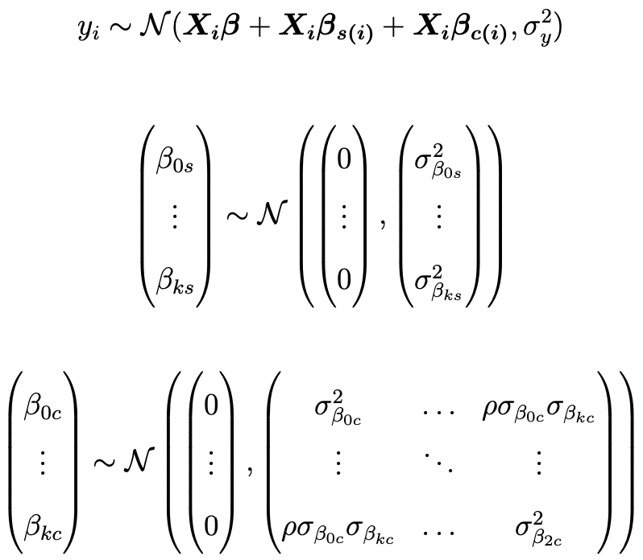
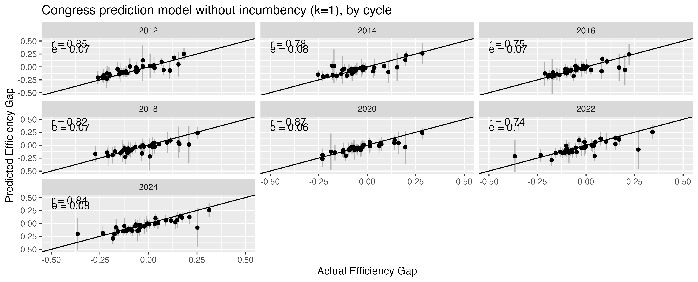
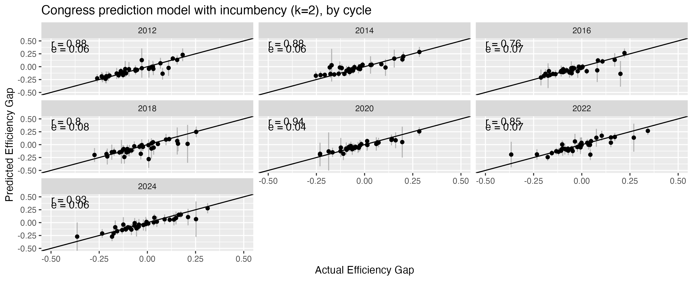
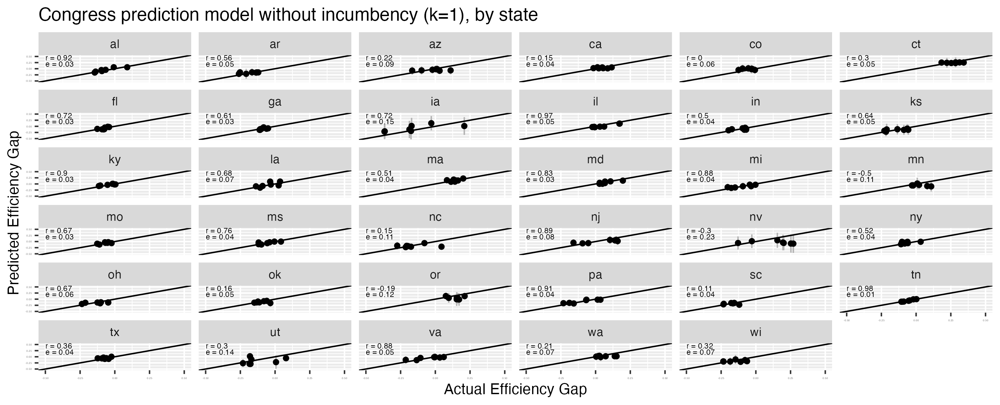
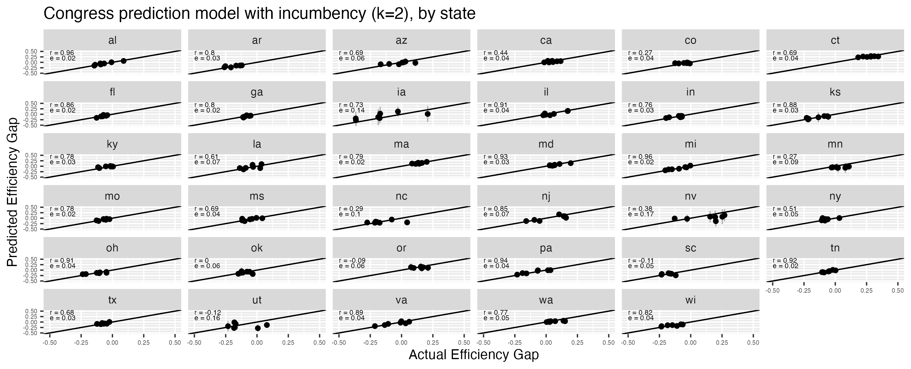

Unified District Model
===

_September 2025_

In order to score new plans, it is necessary to create a statistical model of the relationship between districts’ latent partisanship and candidates’ incumbency status with election outcomes. This enables us to estimate district-level vote shares for a new map and the corresponding partisan gerrymandering metrics. This page describes the details of our methodology and how we validate the results of this model.

Results for uncontested elections are imputed as described in [*The Impact of Partisan Gerrymandering on Political Parties*](https://onlinelibrary.wiley.com/doi/abs/10.1111/lsq.12276) and [its appendix](https://onlinelibrary.wiley.com/action/downloadSupplement?doi=10.1111%2Flsq.12276&file=lsq12276-sup-0001-Supinfo.pdf), by Nicholas Stephanopoulos and Christopher Warshaw.

Methodology
---

#### The Big Picture

We use the correlation between the presidential vote on the one hand and state legislative or congressional votes on the other to predict how new districts will likely vote and so how biased a plan will be. Our correlations come from the last 14 years of elections and are estimated separately for state legislatures and Congress. They factor in how much each state's and election year's results might differ from others and—where appropriate—any extra advantage incumbents might have. We also allow our predictions to be imperfect by quantifying how much our method missed the actual outcomes of past elections, including the degree to which partisan tides have changed party performance from one election to the next. This enables us to generate the most accurate, data-driven, and transparent prediction we can.

This is the model we use when we have the latest geographic election data for a particular state. When we do not have such data, [we use a slightly different model described here](../2025A/). At present we only have fully updated data for Congress, so only congressional results are reported on this methods page. See the companion page for state legislative results, and for the results of a modified version of the congressional model for states that do not have fully updated data.

#### The Details

We use a Bayesian hierarchical model of district-level election returns, run on either state legislatures or congressional delegations (depending on the outcome of interest), for the elections from 2011 through 2024. Formally, the model is:

where

- 𝑖 indexes district level elections
- 𝑠 indexes states, with 𝑠(𝑖) denoting the state of district election 𝑖
- 𝑐 indexes election cycles, with 𝑐(𝑖) denoting the election cycle of district election 𝑖
- 𝑘 ∈ [1, 2] indexes covariates, with 0 identifying intercepts
- 𝑦𝑖 is the Democratic share of the two-party vote in district election 𝑖
- 𝑿𝑖 is a matrix of covariate values for district election 𝑖
- 𝛽 is a matrix of population-level intercept and slopes corresponding to covariates 𝑿
- 𝛽𝑠(𝑖) and 𝛽𝑐(𝑖) are matrices of coefficients for the state and election cycle, respectively, of district election 𝑖
- 𝜎𝑦 is the residual population-level error term

The model allows the slope for all our covariates—as well as the corresponding intercept—to vary across both states and election cycles. Based on exploration of different model specifications, we allow for correlated random effects across cycles but assume no such correlation across states to facilitate convergence.

We run separate models for state legislative and congressional outcomes and with and without incumbency as a covariate. PlanScore identifies a plan as state legislative or congressional based on the number of seats in the plan and the state for which it is submitted.

𝑘 ranges between 1 and 2: if a user designates incumbency for any seat in a plan, predictions come from the model that includes both presidential vote and incumbency as covariates; if all seats are left open, predictions come from a model with only presidential vote. Presidential vote is the two-party district-level Democratic presidential vote share, centered around its global mean (0.515), while incumbency status in district election 𝑖 is coded -1 for Republican, 0 for open, and 1 for Democratic. We do not have the 2020 presidential vote for estimating new plans in two states—Kentucky and South Dakota—so we used the 2016 presidential vote in the model for those states. In the small number of remaining state-cycle combinations that were missing presidential vote we used the presidential vote for the same district in the next presidential election (or the previous presidential election where the next one was not available).

When generating predictions, PlanScore draws 1000 samples from the posterior distribution of model parameters, and uses them to calculate means and probabilities. We also add in the offsets for the 2024 presidential election cycle, and then also add in samples from the covariance matrix of cycle random effects to allow the uncertainty of predicting for an unknown election cycle to propagate into our predictions. This has the effect of predicting for an election like 2024 in most respects, but with error bounds that encompass the full range of partisan tides that occurred over the last decade.

Full results for our four separate models can be found below.

<table>
    <caption>Table 1: Congress prediction model with incumbency (𝑘 = 2)</caption>
    <thead>
        <tr>
            <th></th>
            <th style="text-align:right">Estimate</th>
            <th style="text-align:center">95% Credible Interval</th>
        </tr>
    </thead>
    <tbody>
        <tr>
            <th colspan="3" style="padding-top:.5em">POPULATION-LEVEL</th>
        </tr>
        <tr>
            <td style="font-weight:normal">Intercept (𝛽0)</td>
            <td align="right">0.51</td>
            <td align="center">[0.49, 0.54]</td>
        </tr>
        <tr>
            <td style="font-weight:normal">Presidential vote (𝛽1)</td>
            <td align="right">0.87</td>
            <td align="center">[0.80, 0.93]</td>
        </tr>
        <tr>
            <td style="font-weight:normal">Incumbency (𝛽2)</td>
            <td align="right">0.04</td>
            <td align="center">[0.02, 0.05]</td>
        </tr>
        <tr>
            <th colspan="3" style="padding-top:.5em">STATE-LEVEL</th>
        </tr>
        <tr>
            <th colspan="3" style="padding-top:.5em">Standard Deviations</th>
        </tr>
        <tr>
            <td style="font-weight:normal">Intercept (𝜎𝛽0𝑠)</td>
            <td align="right">0.01</td>
            <td align="center">[0.01, 0.01]</td>
        </tr>
        <tr>
            <td style="font-weight:normal">Presidential vote (𝜎𝛽1𝑠)</td>
            <td align="right">0.08</td>
            <td align="center">[0.06, 0.11]</td>
        </tr>
        <tr>
            <td style="font-weight:normal">Incumbency (𝜎𝛽2𝑠)</td>
            <td align="right">0.01</td>
            <td align="center">[0.01, 0.01]</td>
        </tr>
        <tr>
            <th colspan="3" style="padding-top:.5em">CYCLE-LEVEL</th>
        </tr>
        <tr>
            <th colspan="3" style="padding-top:.5em">Standard Deviations</th>
        </tr>
        <tr>
            <td style="font-weight:normal">Intercept (𝜎𝛽0𝑐)</td>
            <td align="right">0.03</td>
            <td align="center">[0.01, 0.06]</td>
        </tr>
        <tr>
            <td style="font-weight:normal">Presidential vote (𝜎𝛽1𝑐)</td>
            <td align="right">0.07</td>
            <td align="center">[0.03, 0.14]</td>
        </tr>
        <tr>
            <td style="font-weight:normal">Incumbency (𝜎𝛽2𝑐)</td>
            <td align="right">0.02</td>
            <td align="center">[0.01, 0.03]</td>
        </tr>
        <tr>
            <th colspan="3" style="padding-top:.5em">Correlations</th>
        </tr>
        <tr>
            <td style="font-weight:normal">Intercept - Pres. vote (𝜌𝜎𝛽0𝑐𝜎𝛽1𝑐)</td>
            <td align="right">−0.09</td>
            <td align="center">[−0.72, 0.65]</td>
        </tr>
        <tr>
            <td style="font-weight:normal">Intercept - Incumbency (𝜌𝜎𝛽0𝑐𝜎𝛽2𝑠)</td>
            <td align="right">−0.37</td>
            <td align="center">[−0.87, 0.34]</td>
        </tr>
        <tr>
            <td style="font-weight:normal">Pres. vote - Incumbency (𝜌𝜎𝛽1𝑐𝜎𝛽2𝑐)</td>
            <td align="right">−0.59</td>
            <td align="center">[−0.94, 0.16]</td>
        </tr>
        <tr>
            <td colspan="3" style="padding-top:1em;font-weight:normal">
                Note: Model estimated in brms for R. Model based on 4 MCMC chains run for 6000 iterations each with a 2000 iteration warm-up. All model parameters converged well with 𝑅̂ &lt; 1.01.
            </td>
        </tr>
    </tbody>
</table>

<table>
    <caption>Table 2: Congress prediction model without incumbency (𝑘 = 1)</caption>
    <thead>
        <tr>
            <th></th>
            <th style="text-align:right">Estimate</th>
            <th style="text-align:center">95% Credible Interval</th>
        </tr>
    </thead>
    <tbody>
        <tr>
            <th colspan="3" style="padding-top:.5em">POPULATION-LEVEL</th>
        </tr>
        <tr>
            <td style="font-weight:normal">Intercept (𝛽0)</td>
            <td align="right">0.51</td>
            <td align="center">[0.49, 0.53]</td>
        </tr>
        <tr>
            <td style="font-weight:normal">Presidential vote (𝛽1)</td>
            <td align="right">1.04</td>
            <td align="center">[0.99, 1.09]</td>
        </tr>
        <tr>
            <th colspan="3" style="padding-top:.5em">STATE-LEVEL</th>
        </tr>
        <tr>
            <th colspan="3" style="padding-top:.5em">Standard Deviations</th>
        </tr>
        <tr>
            <td style="font-weight:normal">Intercept (𝜎𝛽0𝑠)</td>
            <td align="right">0.02</td>
            <td align="center">[0.01, 0.02]</td>
        </tr>
        <tr>
            <td style="font-weight:normal">Presidential vote (𝜎𝛽1𝑠)</td>
            <td align="right">0.08</td>
            <td align="center">[0.06, 0.11]</td>
        </tr>
        <tr>
            <th colspan="3" style="padding-top:.5em">CYCLE-LEVEL</th>
        </tr>
        <tr>
            <th colspan="3" style="padding-top:.5em">Standard Deviations</th>
        </tr>
        <tr>
            <td style="font-weight:normal">Intercept (𝜎𝛽0𝑐)</td>
            <td align="right">0.03</td>
            <td align="center">[0.01, 0.05]</td>
        </tr>
        <tr>
            <td style="font-weight:normal">Presidential vote (𝜎𝛽1𝑐)</td>
            <td align="right">0.05</td>
            <td align="center">[0.03, 0.11]</td>
        </tr>
        <tr>
            <th colspan="3" style="padding-top:.5em">Correlations</th>
        </tr>
        <tr>
            <td style="font-weight:normal">Intercept - Pres. vote (𝜌𝜎𝛽0𝑐𝜎𝛽1𝑐)</td>
            <td align="right">−0.55</td>
            <td align="center">[−0.95, 0.29]</td>
        </tr>
        <tr>
            <td colspan="3" style="padding-top:1em;font-weight:normal">
                Note: Model estimated in brms for R. Model based on 4 MCMC chains run for 6000 iterations each with a 2000 iteration warm-up. All model parameters converged well with 𝑅̂ &lt; 1.01.
            </td>
        </tr>
    </tbody>
</table>

Predictions
---

The charts below show comparisons between this model’s in-sample predictions and observed historical scores for plans with at least 7 districts.

Data Sources
---

Precinct-level presidential vote data used by this model is mostly sourced from the [Voting and Election Science Team](https://dataverse.harvard.edu/dataverse/electionscience) at University of Florida and Wichita State University.
