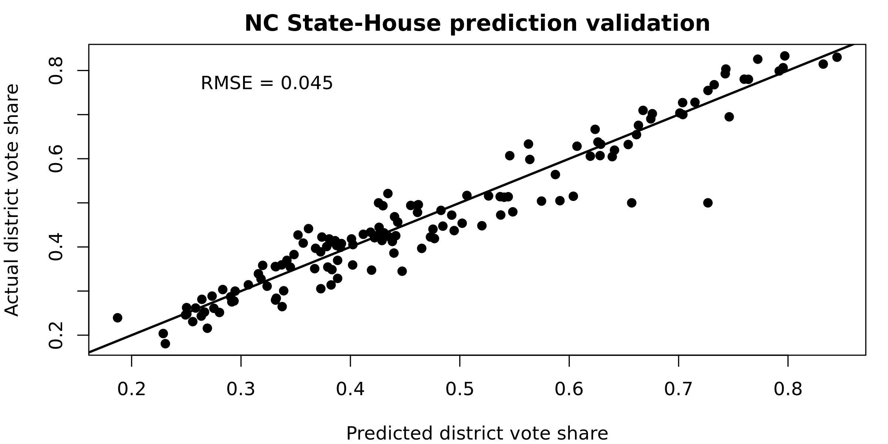

North Carolina State House of Representatives Model (version 6)
===

_September 2019_

PlanScore bases its scores on predicted precinct-level votes for North Carolina State House of Representatives built from past election results and U.S. Census data. To predict future major-party results, we compare precinct-level results from 2018 State House of Representatives races with the 2016 Clinton/Trump presidential election.

We obtained all results from North Carolina’s State Board of Elections, [assembled them in a single table](https://docs.google.com/spreadsheets/d/16OdAi0hyownQT0e_CCA9idz78HXmhaWd1UlXQ9lAw-Y), and entered them into our [ordinary least squares regression model](https://github.com/PlanScore/Model-Generator):

[Browse model code and data on Github](https://github.com/PlanScore/Model-NC/tree/95b1e9d).