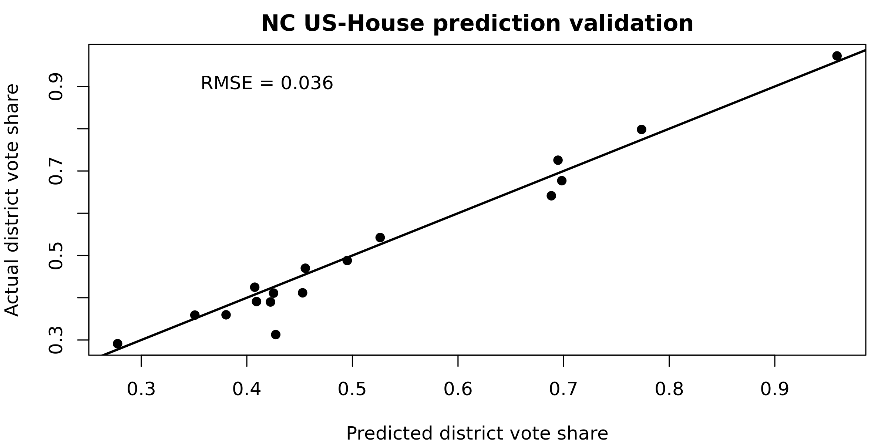

North Carolina U.S. Congressional Model (version 7)
===

_January 2020_

PlanScore bases its scores on predicted precinct-level votes for North Carolina U.S. Congressional races built from past election results and U.S. Census data. To predict future major-party results, we compare precinct-level results from 2018 U.S. Congressional races with the 2016 Clinton/Trump presidential election. This model includes predictions for open seat races as well as major-party incumbents, if provided.

We obtained all results from North Carolina’s State Board of Elections and entered them into our [ordinary least squares regression model](https://github.com/PlanScore/Model-Generator):

[Browse model code and data on Github](https://github.com/PlanScore/Model-NC/tree/4f80bc6).
