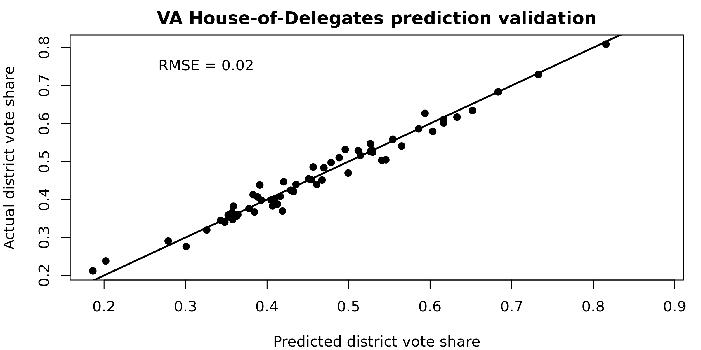

Virginia House of Delegates Model (version 1)
===

_October 2018_

PlanScore bases its scores on predicted precinct-level votes for Virginia House of Delegates built from past election results and U.S. Census data. To predict future major-party results, we compare precinct-level results from 2017 House of Delegates races with the 2016 Clinton/Trump presidential election.

We obtained [results from Virginia’s Department of Elections and OpenElections](https://docs.google.com/spreadsheets/d/1c4TWXsXsBIVLBMifQGmUSVjjU4qCZ1qYpfmREsCiUDE), and entered them into our [ordinary least squares regression model](https://github.com/PlanScore/Model-Generator):

[Browse model code and data on Github](https://github.com/PlanScore/Model-VA/tree/d2f65a5).
